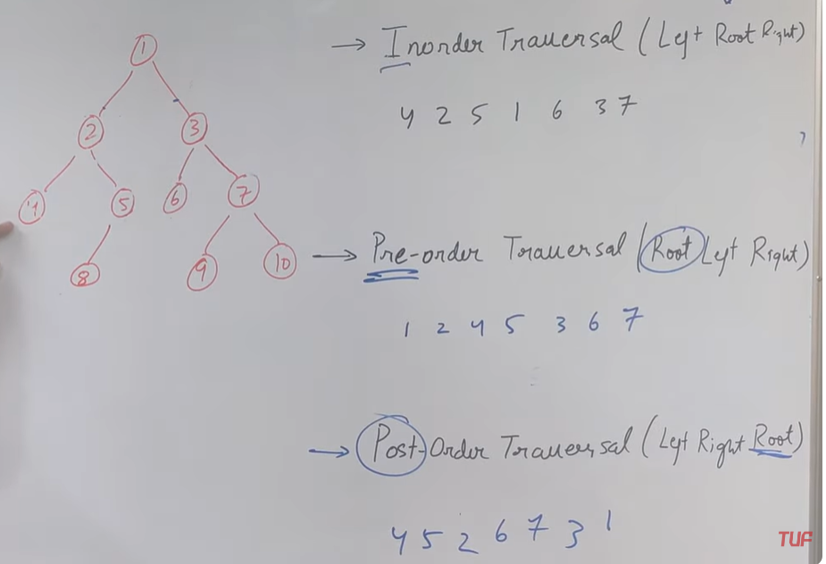

Search Techniques 

Depth first Search 

- Pre-Order
- In-Order
- Post-Order

All are DFS Technique

Pre-Order
Go to the extreme left subtree and then apply the rule ( Left + Root + Right )

In-Order
Go to the extreme left subtree and then apply the rule ( Root + Left + Right )

Post-Order
Go to the extreme left subtree and then apply the rule ( Left + Right + Root )

Breadth First Search

- Level Order